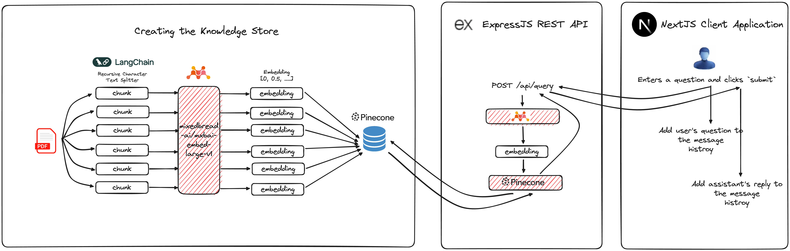

# AI-Powered Chat Interface for Querying PDF Documents Using Vector Similarity Search

## Project Report

### Introduction

Welcome to the project report for the AI-Powered Chat Interface for Querying PDF Documents Using Vector Similarity Search. This report documents the technical aspects of developing a system that allows users to search through PDF documents via a chat interface driven by artificial intelligence.

### Methodology

#### Knowledge Store Preparation

To establish the knowledge store, the PDF documents were processed into smaller chunks. These chunks were transformed into embeddings using the [mixedbread-ai/mxbai-embed-large-v1](https://huggingface.co/mixedbread-ai/mxbai-embed-large-v1) embedding model. The embeddings were stored in a Pinecone database, constituting the knowledge store.

#### User Interaction - Querying

When users interact with the system through the chat interface, the NextJS application forwards their queries to the `/query` endpoint. At this endpoint, the queries are transformed into embeddings using the [mixedbread-ai/mxbai-embed-large-v1](https://huggingface.co/mixedbread-ai/mxbai-embed-large-v1) model. Subsequently, a search is conducted to retrieve relevant text chunks.

#### Response Presentation

The retrieved text segments are presented to users within the chat interface.

### Video Demonstration

To further illustrate the project, here's a video demonstrating the AI-powered chat interface in action:

<iframe width="560" height="315" src="https://www.youtube.com/embed/wwPSA7-fM2A" frameborder="0" allowfullscreen></iframe>

### Technology Stack

The project relies on the following technologies:

- **NextJS**: For web application development and chat interface implementation.
- **Pinecone**: For storage and retrieval of embeddings.
- **mixedbread-ai/mxbai-embed-large-v1 Embedding Model**: Utilized for transforming text segments into embeddings.
- **Node.js**: Handling server-side operations.

### Challenges

#### Finding the Right Embedding Model

Selecting an appropriate embedding model posed a significant challenge. The model needed to effectively capture the essence of text segments to facilitate accurate searches.

### Key Learnings

#### Importance of Embeddings

The project underscored the critical role of embeddings in facilitating efficient text search and retrieval operations.

## Conclusion

The AI-Powered Chat Interface for Querying PDF Documents Using Vector Similarity Search project demonstrates the effectiveness of leveraging artificial intelligence to enhance document search capabilities. By combining embeddings and vector similarity search, users can seamlessly navigate through PDF documents via a conversational interface, simplifying the information retrieval process.